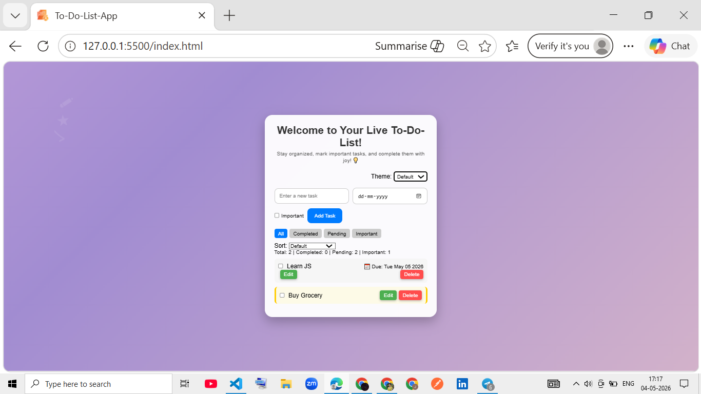

# Live To-Do List App

A full-featured and responsive To-Do List web application built using HTML, CSS, and Vanilla JavaScript.

This project demonstrates strong frontend fundamentals including DOM manipulation, state management, localStorage persistence, drag-and-drop interactions, filtering, sorting, accessibility improvements, responsive design, and theme customization.

The application was developed using a professional GitHub workflow with issues, feature branches, pull requests, and structured commits.

---

## Features

### Task Management
- Add new tasks
- Edit existing tasks
- Delete tasks
- Prevent empty task submissions
- Mark tasks as completed or pending
- Add important tasks
- Add due dates to tasks

---

### Task Organization
- Filter tasks:
  - All
  - Completed
  - Pending
  - Important

- Sort tasks:
  - A-Z
  - Z-A
  - Due Date
  - Important First

- Drag and drop task reordering

---

### UI & UX Features
- Light theme
- Dark theme
- Neon theme
- Floating icon animations
- Hover effects and smooth transitions
- Empty state handling
- Responsive design for:
  - Mobile
  - Tablet
  - Desktop

---

### Accessibility
- ARIA labels added
- Keyboard-friendly interactions
- Semantic HTML structure

---

### Data Persistence
- Tasks stored using browser localStorage
- Task states persist after page refresh

---

## Tech Stack

- HTML5 – Semantic structure
- CSS3 – Styling, responsiveness, animations
- JavaScript (ES6) – Application logic and DOM manipulation

---

## Project Structure

To-Do-List/
├── index.html
├── style.css
├── script.js
└── README.md
---

## How It Works

- Users can create and manage tasks dynamically
- Tasks are rendered using JavaScript DOM manipulation
- Filters and sorting update the UI instantly
- Tasks persist using localStorage
- Drag-and-drop updates task order dynamically
- Theme switching updates the UI in real time

---

## Development Workflow

This project follows a professional Git workflow:

- GitHub Issues for feature planning
- Feature-based branching strategy
- Pull Requests for merging changes
- Self code reviews before merge
- Structured commit messages

---

## Screenshot

---

## Live Demo

(Deployment link will be added here)

---

## Project Status

✅ Completed

---

## Key Learning Outcomes

- DOM manipulation using Vanilla JavaScript
- State management
- localStorage integration
- Dynamic rendering
- Responsive UI development
- Accessibility improvements
- Drag-and-drop implementation
- Git & GitHub workflow
- Feature branch development
- Pull request workflow

---

## Author

Built for frontend development practice and portfolio building